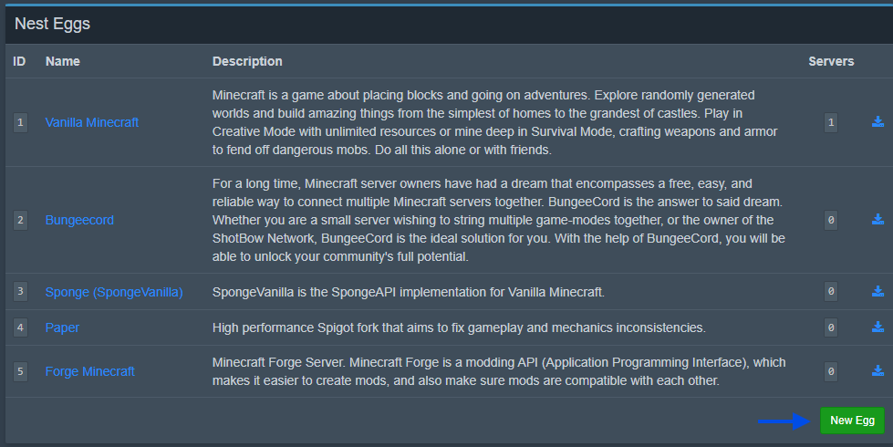
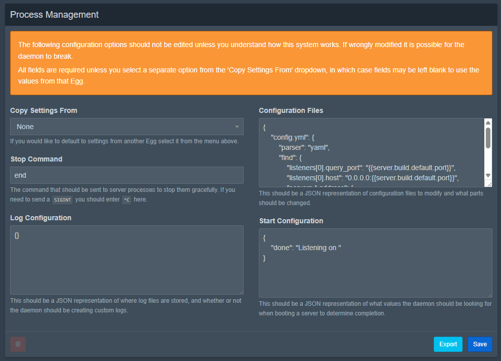
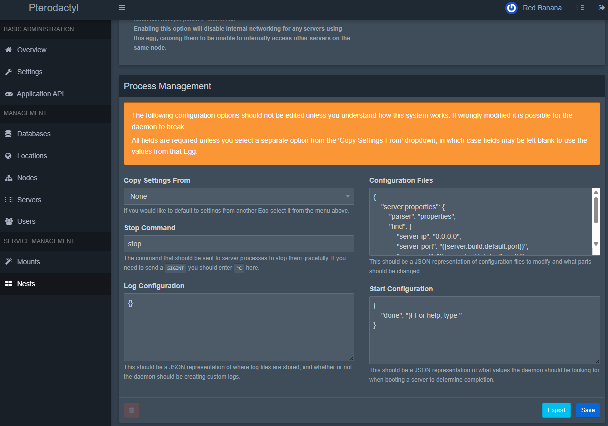
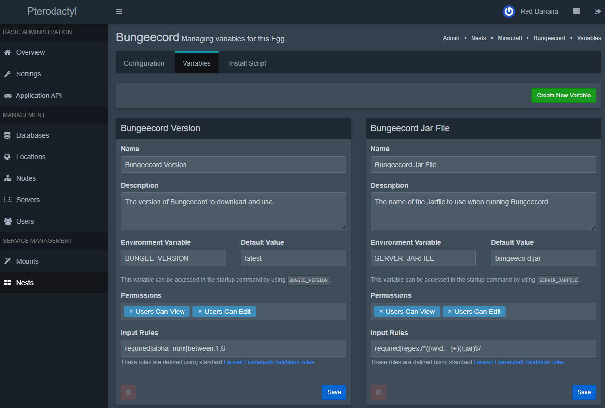
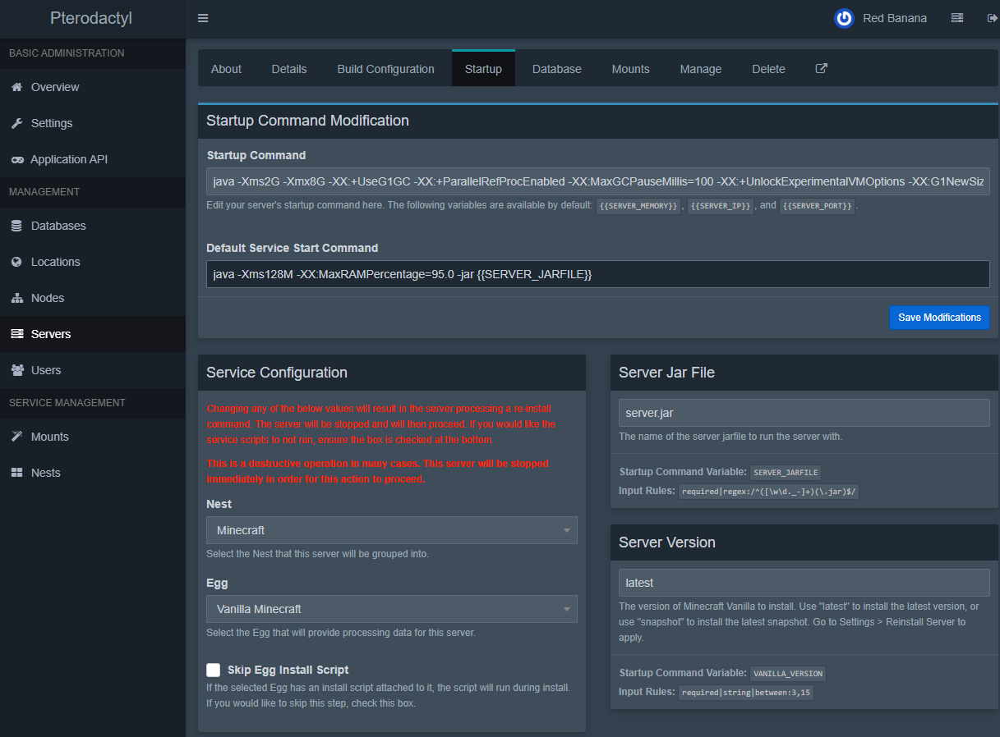

# Creating a Custom Egg
::: warning
You should not edit existing services or options that ship with the Panel. Each upgrade we push can make minor
changes to these, and you'll lose any changes you've made.
:::

[[toc]]

The first thing you'll need to do is create a new service. In this case, the name and description speak for themselves.
The `Folder Name` _must be a unique name_ not being used by any other service, and should only
contain letters, numbers, underscores, and dashes. This is the name of the folder where the daemon will be storing
the service options on the daemon.

The default start command is also required, however it can be changed per-option.

## Create New Option
After creating the service, in the bottom right of the page you should see a button titled `New Egg`, press it.



You will be taken to a new service option page which is where most of the configuration happens. The first thing
you need to do is select your service that you created previously from the `Associated Nest` dropdown.



After that, enter an Option Name to describe it, in this case I am using `Widget`. You will also need to provide a
_valid_ docker image, as well as a start command to be assigned to servers under this service option (remember, this
can be tweaked per-server if needed).

_Docker images must be specifically designed to work with Pterodactyl Panel._ You should read more about that in
our [Creating a Docker Image](/community/config/eggs/creating_a_custom_image.md) guide.

## The Pterodactyl Install Procces

::: warning
Please be aware of how the pterodactyl install process works!
:::

```
1. Spin up install container
    Creates a new container using an install image which runs as root.
    Uses a volume mount on `/mnt/server` for the server files, which is the working directory during installation.
    The volume will be later mounted as `/home/container` for the server container. Any files outside of `/mnt/server` will be gone after installation.
    The installation script can set up everything that's required to run the server, such as writing files, creating directories, or compiling apps.
    It is regularly used to just download the files required, such as server files and configs.
    
2. Stop and destroy install container

3. Start a new container with the server files in /home/container
    This is where the server is is actually ran, without root privileges.
    Any dependencies installed during the install process are gone.
    The container that is started should have everything you need.
    No packages can be installed. Any required dependencies must exist in the used Docker image.
```

## Configure Process Management
This is perhaps the most important step in this service option configuration, as this tells the Daemon how to run everything.


The first field you'll encounter is `Copy Settings From`. The default selection is `None`. That is expected, and okay.
This dropdown is discussed at the end of this article.

### Stop Command
Next, you'll encounter `Stop Command` and, as the name implies, this should be the command used to safely stop the
option. For some games, this is `stop` or `end`. Certain programs and games don't have a specified stop command, so
you can enter `^C` to have the daemon execute a `SIGINT` to end the process.

### Log Storage
Logs are competely handeled by the daemon now and use the docker logs to output the complete output from the server.
This can be set like below.

```json
{}
```

### Configuration Files
The next block is one of the most complex blocks, the `Configuration Files` descriptor. The Daemon will process this
block prior to booting the server to ensure all of the required settings are defined and set correctly.

```json
{
    "server.properties": {
        "parser": "properties",
        "find": {
            "server-ip": "0.0.0.0",
            "enable-query": "true",
            "server-port": "{{server.build.default.port}}",
            "query.port": "{{server.build.default.port}}"
        }
    }
}
```

In this example, we are telling the Daemon to read `server.properties` in `/home/container`. Within this block, we
define a `parser`, in this case `properties` but the following are [valid parsers](https://github.com/pterodactyl/wings/blob/develop/parser/parser.go#L25-L30):

* `file` — This parser goes based on matching the beginning of lines, and not a specific property like the other five.
Avoid using this parser if possible.
* `yaml` (supports `*` notation)
* `properties`
* `ini`
* `json` (supports `*` notation)
* `xml`

::: tip
If you want to use egg non stock variables in the configuration parser you must reference them as 
```text
{{server.build.env.ENVNAME}}
``` 
or just 
```text
{{env.ENVNAME}}
```
Do not forget to to replace `ENVNAME` with the actual environment name you have setup.
:::

Once you have defined a parser, we then define a `find` block which tells the Daemon what specific elements to find
and replace. In this example, we have provided four separate items within the `server.properties` file that we want to
find and replace to the assigned values. You can use either an exact value, or define a specific server setting from
the `server.json` file. In this case, we're assigning the default server port to be used as the `server-port` and
`query.port`. **These placeholders are case sensitive, and should have no spaces in them.**

You can have multiple files listed here, the Daemon will process them in parallel before starting the server. When
using `yaml` or `json` you can use more advanced searching for elements.

```json
{
    "config.yml": {
        "parser": "yaml",
        "find": {
            "listeners[0].query_enabled": true,
            "listeners[0].query_port": "{{server.build.default.port}}",
            "listeners[0].host": "0.0.0.0:{{server.build.default.port}}",
            "servers.*.address": {
                "127.0.0.1": "{{config.docker.interface}}",
                "localhost": "{{config.docker.interface}}"
            }
        }
    }
}
```

In this example, we are parsing `config.yml` using the `yaml` parser. The first three find items are simply assigning
ports and IPs for the first listener block. The last one, `servers.*.address` uses wildcard matching to match any items
within the `servers` block, and then finding each `address` block for those items.

::: v-pre
An advanced feature of this file configuration is the ability to define multiple find and replace statements for a
single matching line. In this case, we are looking for either `127.0.0.1` or `localhost` and replacing them with the
docker interface defined in the configuration file using `{{config.docker.interface}}`. 
:::

#### File Parser
The file parser replaces the whole line that you are trying to edit. So you have to use it like this:

```json
{
    "main/server.cfg": {
        "parser": "file",
        "find": {
            "seta sv_hostname": "seta sv_hostname \"{{env.SERVER_NAME}}\"",
            "seta sv_maxClients": "seta sv_maxClients \"{{env.SERVER_MAXCLIENTS}}\"",
            "seta rconPassword": "seta rconPassword \"{{env.RCON_PASSWORD}}\"",
            "seta g_password": "seta g_password \"{{env.SERVER_PASSWORD}}\"",
            "Map": "Map {{env.SERVER_MAP}}"
        }
    }
}
```

The `"` on the right side are escaped with a `\` because else they would break the json syntax for the parser.

### Start Configuration
The last block to configure is the `Start Configuration` for servers running using this service option.

```json
{
    "done": ")! For help, type "
}
```

In the example block above, we define `done` as the entire line, or part of a line that indicates a server is done
starting, and is ready for players to join. When the Daemon sees this output, it will mark the server as `ON` rather
than `STARTING`. 

If your application has multiple messages that mean that it is fully startup then you can also do it like this:
```json
{
  "done":[
    "change this text 1",
    "change this text 2"
  ]
}
```

That concludes basic service option configuration.

## Copy Settings From
As mentioned above, there is a unique `Copy Settings From` dropdown when adding a new option. This gives you the
ability to, as the name suggests, copy settings defined above from a different option.



In the panel, we use this to copy settings that remain the same between similar service options, such as many of the
Minecraft options.

For example, lets look at the `Sponge (SpongeVanilla)` service option.

As you can see, it as been told to copy settings from `Vanilla Minecraft`. This means that any of the fields that are
left blank will inherit from the assigned parent. We then define a specific `userInteraction` line that is different in
Sponge compared to Vanilla, but tell it that everything else should remain the same.

*Please note that `Copy Settings From` does not support nested copies, you can only copy from a single parent,
and that parent **must not be copying from another option.***

## Egg Variables
One of the great parts of the Egg Variables is the ability to define specific variables that users and/or admins can
control to tweak different settings without letting users modify the startup command. To create new variables, or edit
existing ones, visit the new service option you created, and click the `Variables` tab at the top of the page. Lets take
a look at an example variable that we can create.



::: v-pre
The name and description are rather self-explanitory, so I'll skip down to the `Environment Variable` box. This should
be an Alpha-Numeric name with underscores, and should be uppercase. This will be the name of the environment variable
which can be accessed in the startup command as `{{WOOZLE_WOO}}`, within file modifications as `{{env.WOOZLE_WOO}}`, or
just `${WOOZLE_WOO}` in any shell scripts (it is passed through in the environment). We also define a default value for
this environment variable in this example, but it is not required to do so.
:::

The next section is `Permissions`, which is a dropdown with two options: `Users Can View` and `Users Can Edit`.

* `Users Can View` — allows a user to view the field on the front-end, as well as the assigned value of that variable.
They will be able to see it replaced in their startup command.
* `Users Can Edit` — allows a user to edit the value of the variable, for example the name of their `server.jar` file
if running Minecraft.

You should use caution here, even if you assign neither of the permissions it does not mean that the value will be
hidden. Crafty users will still be able to get the environment on their server. In most cases this is simply hiding
it from the user, and then used within the Dockerfile to perform actions, thus it is not important for the user to see.

Finally, you will need to define some input rules to validate the value against. In this example, we use
`required|string|between:1,10`, which means the field is `required`, must be a `string`, and must be between `1` and
`10` characters in length. You can find [all of the available validation rules](https://laravel.com/docs/5.6/validation#available-validation-rules)
on the Laravel website. You can also use ReGEX based validation by using the `regex:` rule flag. For example,
[`required|regex:/^([\w\d._-]+)(\.jar)$/`](https://regex101.com/r/k4oEOn/1) will require the field, and will match the
regex as any letters or numbers (`\w\d`) including underscore (`_`), periods (`.`), and dashes (`-`) ending in `.jar`.

They will then be visible when managing the startup for a server in both the Admin CP and on the Front-End.



## List of default variables

The default variables are always accessible to all eggs and don't have to be created separately. They can be used in the egg startup, install script, or the configuration file parser.

| Variable | Description | Example |
|----------|-------------|---------|
| TZ       | Time Zone |  `Etc/UTC` |
| STARTUP  | Startup command of the egg | `java -Xms128M -Xmx{{SERVER_MEMORY}}M -jar {{SERVER_JARFILE}}` |
| SERVER_MEMORY | Memory available for the server in MB | `512` |
| SERVER_IP | Default ip of the server | `127.0.0.1` |
| SERVER_PORT | Primary Server Port | `27015` |
| P_SERVER_LOCATION | Location of the server | `Example City` |
| P_SERVER_UUID | UUID of the server | `539fdca8-4a08-4551-a8d2-8ee5475b50d9` |
| P_SERVER_ALLOCATION_LIMIT | Limit of allocations allowed for the server | `0` |
