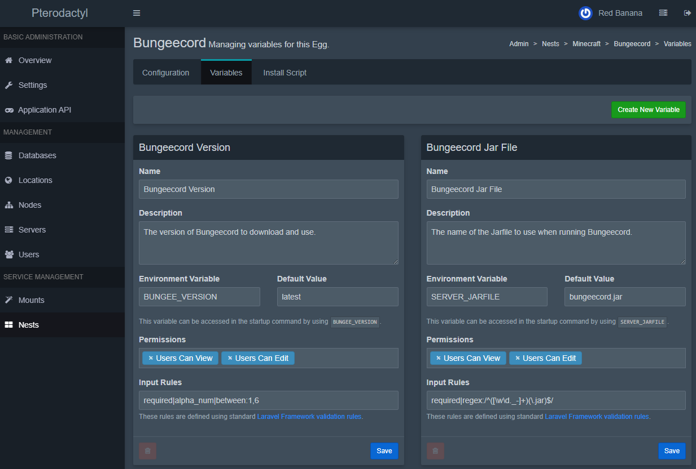

# Egg Variables

[[toc]]

One powerful feature of eggs is the ability to define **variables** that can be used to customize the server’s startup and configuration without editing the startup command directly. Egg variables are exposed as environment variables to the server and can be referenced in the install script or config files.

To manage an egg’s variables, create the egg (or edit an existing one) and navigate to the **Variables** tab on the egg configuration page.

## Types of Egg Variables

- **Default Variables:** These are provided by the Panel/Wings automatically for every server. (You do **not** need to create these; they always exist.)

- **Custom Variables:** These are defined by you on the egg’s Variables tab.

## Default Variables

These are injected into every server environment by default and can be referenced using the following syntaxes:

- In the startup command, reference it as <code v-pre>{{VARIABLE}}</code>.
- In scripts: <code v-pre>$VARIABLE_NAME</code> or <code v-pre>{{server.build.default.VARIABLE_NAME}}</code>
- In configuration parser entries, reference it as <code v-pre>{{env.VARIABLE}}</code>.

| Variable Name                | Description                                                              | Example                        |
|-----------------------------|--------------------------------------------------------------------------|--------------------------------|
| `TZ`                        | Time Zone set in the panel's `.env` file                                 | `Etc/UTC`                      |
| `STARTUP`                   | The actual resolved startup command for the server                       | `./run.sh -arg1`               |
| `SERVER_MEMORY`             | Allocated memory for the server in megabytes                             | `1024`                         |
| `SERVER_IP`                 | The IP address assigned to the primary allocation                        | `192.168.1.2`                 |
| `SERVER_PORT`               | The main port assigned to the server                                     | `27015`                        |
| `P_SERVER_LOCATION`         | The name of the location (set by the admin in the panel)                 | `Amsterdam-01`                 |
| `P_SERVER_UUID`             | UUID of the server instance (used for tracking within Wings)             | `ab12cd34-5678-90ef-ghij-klmn12345678` |
| `P_SERVER_ALLOCATION_LIMIT` | The maximum number of allocations available to this server (if set)      | `3`                            |
| `USER`                      | The user executing processes inside the container                        | `container`                    |
| `HOME`                      | The home directory inside the container                                  | `/home/container`              |

## Custom Variables

Each variable allows you to define:
- The Environment Variable, For example: `MAX_PLAYERS`
- A default value
- Description (shown to the user in the panel)
- Validation Rules
- Whether it is viewable or editable by the user

## Creating a New Variable
When creating a new custom variable, you will provide:

- **Name:** A friendly name for the variable (e.g. “Max Players”).

- **Description:** A description shown to the user (explain what the variable does).

- **Environment Variable:** The actual environment variable name used in code (use **UPPERCASE** letters, numbers, and underscores only). For example, `MAX_PLAYERS`. This is the name that will be referenced in the startup command or configuration files.

- **Default Value:** (Optional) A default value for this variable. This will be used if the user doesn’t input anything else.

- **User Permissions:** Whether the user can view and/or edit this variable on their server:  
  - *Users Can View* – If set, the user can see this variable (and its value) in their server’s settings.  
  - *Users Can Edit* – If set, the user can change the value of this variable from the default.  
  (If neither option is enabled, the variable is essentially hidden from the user’s front-end view, though it still exists in the server’s environment.)

### Validation Rules
- **Rules:** Validation rules for the user’s input. This uses Laravel’s validation rule format. For example, `required|string|between:1,10` means the value is required, must be a string, and 1 to 10 characters in length. You can also use regex patterns. For instance, to require a value ending in “.jar”, you could use a rule like `required|regex:/^([\w\d._-]+)(\.jar)$/` which will only accept values that match that pattern.

::: warning
Even if you choose not to allow users to view or edit a variable, **be aware that it’s not truly secret from the user**. Advanced users could still find the variable’s value (since it exists in the server environment). Typically, hiding a variable is just to prevent casual users from changing or seeing it when it’s not necessary for them to interact with (for example, a variable that is used internally by the egg).
:::

After creating custom variables, both the custom and default variables can be seen when viewing the server’s startup in the Panel (in both Admin and client views). The startup command preview will show these variables substituted with their actual values.
