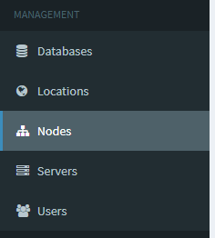

# Add a Node

## Locating the Create Node page
Head to the admin side of the panel and click the Nodes Tab on the left sidebar.

Click On _Create New_

## Fill out information for the node

### Name
A quick identifiable name for the daemon

### Description
A long description that you cna fill out however you want.

### location
The Location you have the node in. (The location is configured in the locations section)

### FQDN
The fully qualified domain name the node is to use. (Ex. `node.demon.pterodactyl.io`)

### Communication over SSL
If the panel is using SSL then the daemon needs to also haave ssl enabled.

### Behind Proxy
If you ahve the daemon behind a proxy that terminates the ssl before it gets to the daemon then this option should be selected. (you know who you are)

### Server File Directory
Where the daemon is to store the files the servers generate. (Default is `/srv/daemon-data`)

::: tip OVH Users
Some OVH users regularly have their `/home` folder be the largest filesystem. You may want to change to use `/home/daemon-data` if you are on a default OVH box.
:::

### Total Memory
The totaly amount of ram the Node should be able to allocate automatically.
::: danger
You should be leaving space for OS overhead
::: 

### Memory Over-Allocation
The percentage of ram to over-allocate on a Node. (Ex. If you set RAM to 10gb overallocate 20% you can allocate 12gb automatically)

### Total Disck Space
The totaly amount of disk space the Node should be able to allocate automatically.
::: danger
You should be leaving space for OS overhead
::: 

### Disk Over-Allocation
The percentage of disck space to over-allocate on a Node. (Ex. If you set Disk to 100gb overallocate 20% you can allocate 120gb automatically)

### Daemon Port
The port the daemon listens on. (Default is 8080)

### Daemon SFTP Port
The port the daemon sftp-server or standalone sftp-server listen on. (Default is 2022)

## Install the Node

### Official install docs.
[Daemon Installation](/daemon/installing.md)

### Daemon Install Guides
* [CentOS 7](/community/install/daemon/centos7.md)
* [Debian 9](/community/install/daemon/debian9.md)
* [Ubuntu 18.04](/community/install/daemon/ubuntu1804.md)

## Copy Config to the Node

Go to the Node Configuration page

Copy and paste the config into the `core.json` folder. (Default location is `/srv/daemon/config/core.json`)

### Auto-Deploy
This will generate a command to run on the node server to configure the daemon for you. (This needs to be run in the `/srv/daemon` folder)