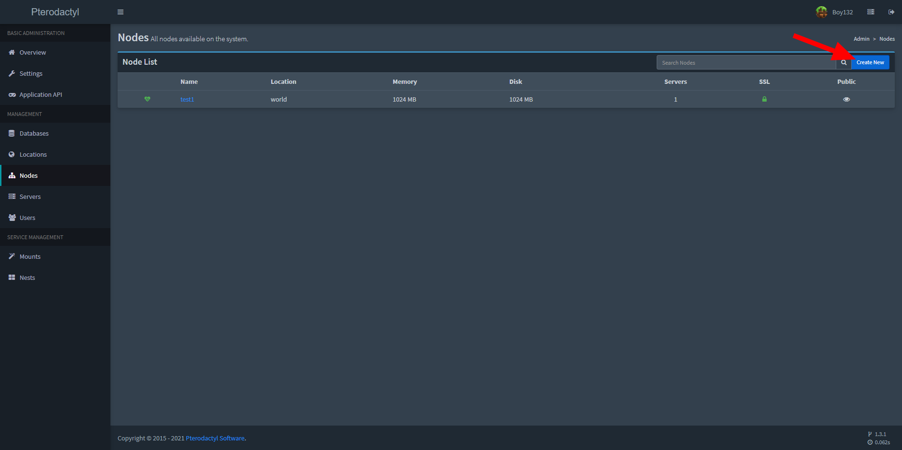
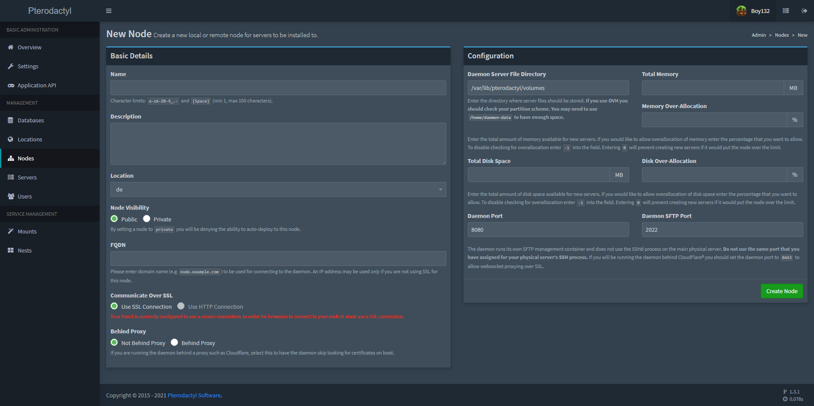
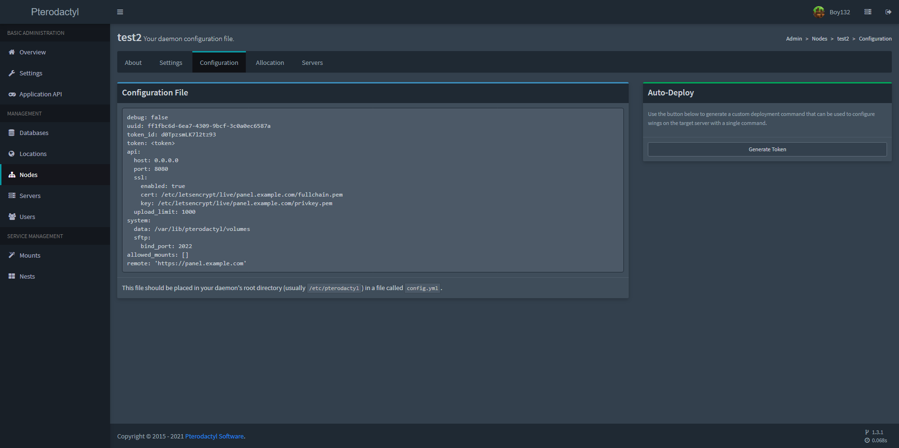

# Creating a New Node

[[toc]]
 
## Location
Head to the admin panel and click the Nodes tab on the left sidebar. After that, click 'Create New' on the
top right side to open the page to add a node.

## Information Required

* **Name**: a quick identifiable name for the node.
* **Description**: a long description that is used to help you identify the node.
* **Location**: the location you want the node in. These are configured in the 'Locations' section of the panel and one
must be created before a node can be created. These simply act as categories for nodes and serve no other purpose at
this time.
* **FQDN**: the fully qualified domain name for the node — for example: `node.pterodactyl.io`
* **Communicate over SSL**: if the panel is using SSL the Daemon is required to use SSL as well.
* **Behind Proxy**: if you have the Daemon behind a proxy that terminates SSL connections before arriving at the Daemon
then this option should be selected. If none of that sentence made sense, this doesn't affect you.
* **Server File Directory**: the location on the physical server where the daemon is to store the files the servers
generate. By default this is `/var/lib/pterodactyl/volumes`.

::: tip OVH Users
Some OVH users regularly have their `/home` folder be the largest filesystem. You may want to change to use
`/home/pterodactyl/volumes` if you are on a default OVH box.
:::

* **Total Memory**: the total amount of RAM the node should be able to allocate automatically.
* **Memory Overallocate**: the percentage of RAM to over-allocate on a node. For example, if you have set a 10GB memory
limit, with a 20% overallocation, the Panel will allocate up to 12GB of memory on this node in total.
* **Total Disk Space**: the total amount of disk space the node should be able to allocate automatically.
* **Disk Overallocate**: works the same way as memory overallocation.

::: danger
Don't forget to account for OS overhead and other software requirements on machines.
::: 

* **Daemon Port**: the port that the Daemon should listen on.
* **Daemon SFTP Port**: the port the Daemon sftp-server or standalone SFTP server should listen on.

## Install the Daemon
At this point you'll need to have the Daemon installed on your machine. Check out the [documentation](/wings/installing.html)
for more information, or try one of the community guides for [CentOS](/community/installation-guides/wings/centos7.html),
or [Debian](/community/installation-guides/wings/debian.html).

## Configuring the Node
Go to the Node Configuration page

Copy and paste the config into the `config.yml` file. (Default location is `/etc/pterodactyl/config.yml`)

### Auto-Deploy
This will generate a command to run on the node server to configure the daemon for you.
