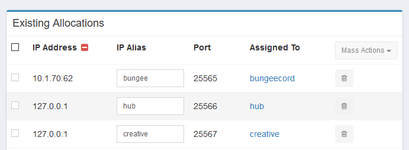
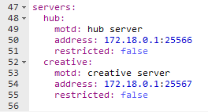
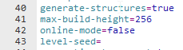
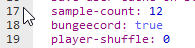

# Minecraft

[[toc]]

## Configuring a Server Network (BungeeCord, Waterfall, HexaCord, etc.)

If you want to operate Minecraft proxy servers like BungeeCord, Waterfall, HexaCord, etc. securely, you can do so with pterodactyl alone as long as you stay on the same node. It differs from a traditional setup in a few ways and might require additonal firewall rules, which is what this guide is for.

:::warning
For the setup described below, it is necessary that all servers are on the same node.
:::

::: danger
If you are a hosting provider, you should only allow a single proxy network per node, if you are selling them to customers.
:::

### Allocations in the Panel

Create a regular allocation for the proxy server which uses the external IP of the node, so users can reach it.

The actual game servers behind the proxy should use allocations with `127.0.0.1` as the address, so they are only reachable on the node, and not from the public.

#### Example



`10.1.70.62` is an example, replace it with your own public IP address.

### proxy server settings

As the proxy server, like all servers, is running in a docker container with network isolation, `localhost`/`127.0.0.1` doesn't refer to the node, but to the container. The node can be reached from within the container using `172.18.0.1` (unless the pterodactyl network is configured differently) instead. You therefore need to use this IP in your proxy server configuration.

#### bungeecord/waterfall configuration

This will be different for other proxy servers, please refer to their documentation.



### paper/spigot/bukkit settings

The servers itself require the regular config options required by server proxies, which usually comes down to disabling online mode. This will differ for other server software, please refer to their documentation.

#### server.properties

set online-mode `false`


#### spigot.yml

set bungeecord to `true`


### Firewalls

If you are using a firewall, additional rules might be required to allow servers to reach each other on the node. In this case the proxy server needs to reach all of the game servers behind it. Therefore we need to allow traffic from the pterodactyl network to the server ports on localhost.

You can use the following commands as an example. `172.18.0.1` is the default address referring to the node within the pterodactyl network. Replace `<LOCALHOST_PORT>` with the allocated localhost ports of the game servers.

:::warning
The following commands will allow any server on the node to access the opened ports.
:::


#### UFW (Ubuntu)

Allow access to the pterodactyl pterodactyl0 network on a specific port.

``` bash
ufw allow in on pterodactyl0 to 172.18.0.1 port <LOCALHOST_PORT> proto tcp
```

#### Firewalld (CentOS)

Allow access to pterodactyl0 from the pterodactyl0 network.

:::warning
This command will allow any server to access all other servers as well as all ports on the node.
:::

``` bash
firewall-cmd --permanent --zone=public --add-source=172.18.0.1
```
