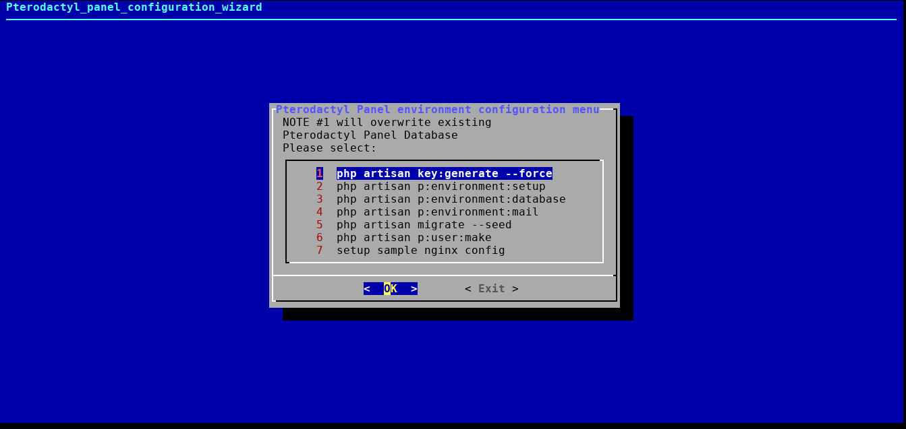

# Archlinux
In this guide we will install Pterodactyl — including all of it's dependencies — and configure it
to use a SSL connection.

[[toc]]

::: tip
This guide is based off the [official installation documentation](/daemon/installing.md) but is tailored specifically for Archlinux.
:::

## Install Requirements
We will first begin by installing [yay](https://github.com/Jguer/yay) to handle the installation of Pterodactyl's Panel ([from the Archlinux User Repos](https://aur.archlinux.org/packages/pterodactyl-daemon/) and it's dependencies.

Commands are assumed to be run as a user (not as root!) unless otherwise specified.

### General Requirements
```bash
sudo pacman -S git base-devel
```
### Installing Yay

```bash
git clone https://aur.archlinux.org/yay-git.git
cd yay-git
makepkg -scif
```

## Installing the Panel with Yay
```
yay -S pterodactyl-panel
```

## Server Configuration
Pterodactyl's Panel and it's [required](/panel/getting_started.md#dependencies) dependencies were installed by yay in the above command, but additional configuration is necessary to run the panel. This following section covers the configuration of parts of the server to run the panel.

### Enabling MariaDB
```bash
systemctl start mariadb
systemctl enable mariadb
```

### Configuring MariaDB
The fastest way to set up mariadb is to use the `mysql_secure_installation` command and follow prompts

```bash
mysql_secure_installation
```

The following are safe defaults.

Change to your own secure password  
`Set root password? [Y/n] Y`

Get rid of users that could access the db by default  
`Remove anonymous users? [Y/n] Y`

Keep root off the external interfaces  
`Disallow root login remotely? [Y/n] Y`

Extra databases that aren't needed  
`Remove test database and access to it? [Y/n] Y`

Clears and sets all the changes made  
`Reload privilege tables now? [Y/n] Y`

All done! If you've completed all of the above steps, your MariaDB installation should now be secure.

#### Adding MariaDB user

To add your first user to the database, see our tutorial on [setting up MySQL](/tutorials/mysql_setup.md).


### Setup PHP
The default php-fpm configuration is fine to use and can be started and then enabled on the system using the
commands below.

```bash
systemctl enable php-fpm
systemctl start php-fpm
```
php-fpm was installed as a dependancy of pterodactyl-panel

### Nginx
```bash
yay -S nginx
systemctl enable nginx
systemctl start nginx
```

A sample nginx configuration is provided by the pterodactyl-panel package. Copy (and symlink) it to the appropriate place as shown below
```bash
cp -b /var/www/pterodactyl/pterodactyl.conf /etc/nginx/sites-available/pterodactyl.conf
ln /etc/nginx/sites-available/pterodactyl.conf /etc/nginx/sites-enabled/pterodactyl.conf
```

Make sure that `/etc/nginx/nginx.conf` has the following line above the last bracket }
```
include sites-enabled/*;
```

Reload nginx
```
nginx -s reload
```

Please check our [tutorial](/tutorials/creating_ssl_certificates.md) on generating SSL certificates for more information.

#### SSL Configuration
<<< @/.snippets/webservers/nginx.conf{5,11,26-27}


### Redis
```bash
systemctl start redis
systemctl enable redis
```

The default Redis install is perfectly fine for the panel. If you have Redis already in use you may want to look into
[running another Redis instance](https://community.pivotal.io/s/article/How-to-setup-and-run-multiple-Redis-server-instances-on-a-Linux-host).

### Additional Utilities

#### Certbot
```bash
apt install -y certbot certbot-nginx
```

## Panel Setup
We need to configure some core aspects of the Panel.

A script has been provided by the pterodactyl-panel package at `/usr/bin/pterodactyl-panel` which provides a menu for completing the following configurations.

``` bash
sudo pterodactyl-panel
```



From here follow the [official Panel installation documentation](/panel/getting_started.md#installation) starting with
```bash
php artisan key:generate --force
```

### Issues & Support

The [pterodactyl-panel](https://aur.archlinux.org/packages/pterodactyl-panel/) and daemon AUR packages are maintained by community members, please submit any packaging issues to the comments section of the [AUR page](https://aur.archlinux.org/packages/pterodactyl-panel/) and not to the Pterodactyl github.
