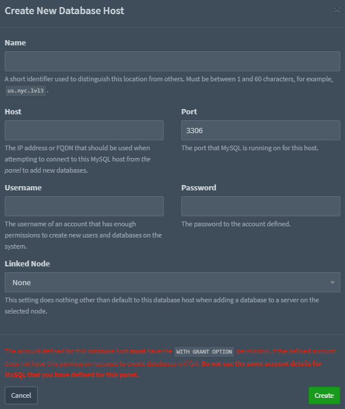

# Database Hosts

Database hosts allow to create per-server databases on the given host.

## Database Configuration

You will need a database user with the correct permissions before
continuing any further. See below to create a user for your database host quickly. To find more detailed information
please have a look at [Setting up MySQL](/tutorials/mysql_setup.html#creating-a-database-host-for-nodes).

```sql
mysql -u root -p

# Remember to change 'yourPassword' below to be a unique password
CREATE USER 'pterodactyluser'@'127.0.0.1' IDENTIFIED BY 'yourPassword';
GRANT ALL PRIVILEGES ON *.* TO 'pterodactyluser'@'127.0.0.1' WITH GRANT OPTION;
exit
```

## Panel Configuration

In the admin area of the panel, go to "Databases" and click the "Create New" button.

Fill in the inputs of the modal:


Hit "Create" and if everything was entered correctly you should be redirected the database hosts list and see your new database host.
