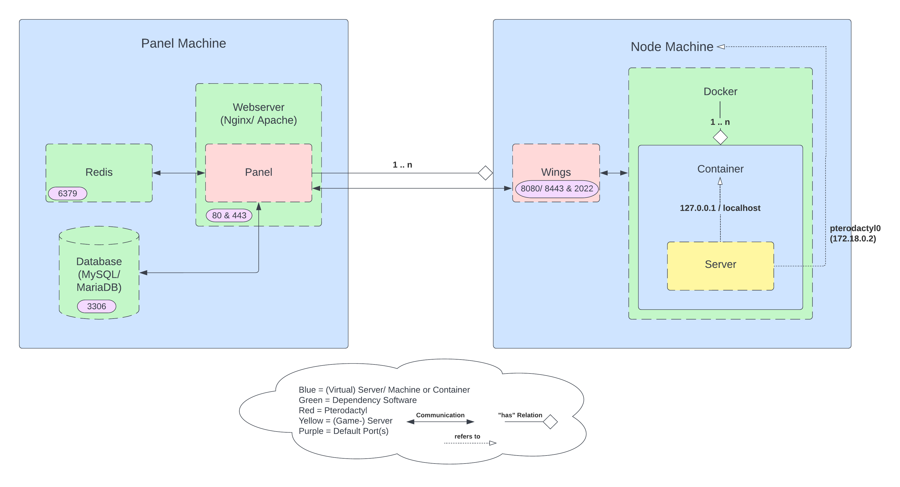

# Terminology
**Panel** — This refers to Pterodactyl Panel itself, and is what allows you to add additional
nodes and servers to the system.

**Node** — A node is a physical machine that runs an instance of the Daemon.

**Daemon** — A service written in Nodejs that interfaces with Docker and the Panel to provide secure access for
controlling servers via the Panel.

**Server** — In this case, a server refers to a running instance that is created by the panel. These servers are
created on nodes, and you can have multiple servers per node.

**Container** — Each server will be running inside an isolated container to enforce hardware limitations
(such as CPU and RAM) and avoid any interference between servers on one node. These are created by Docker.

## Example Setup Diagram

