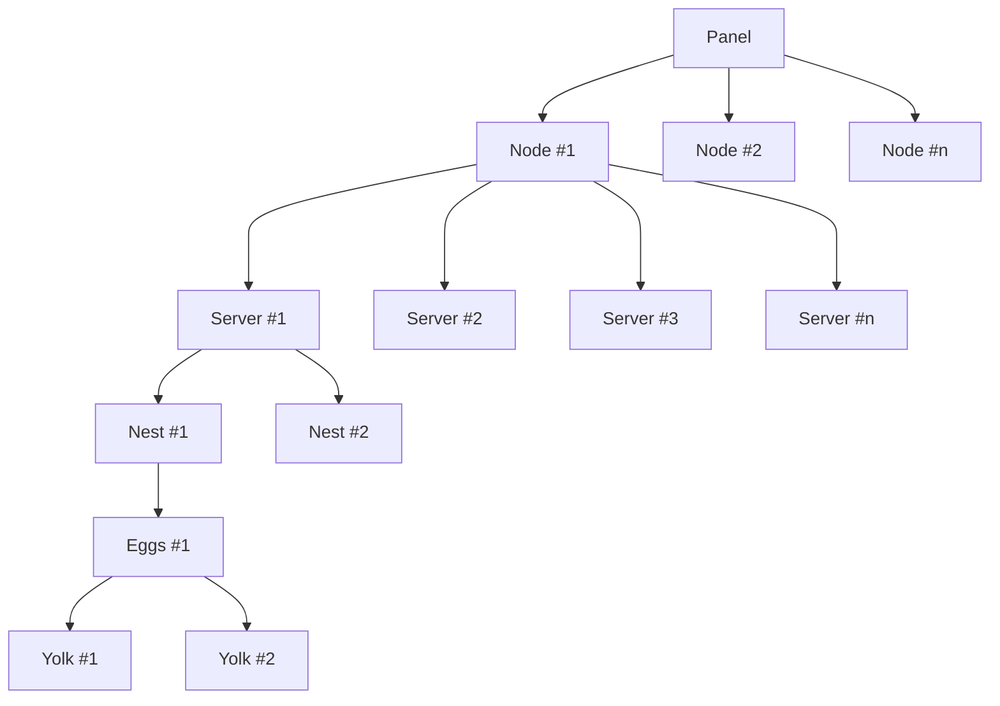
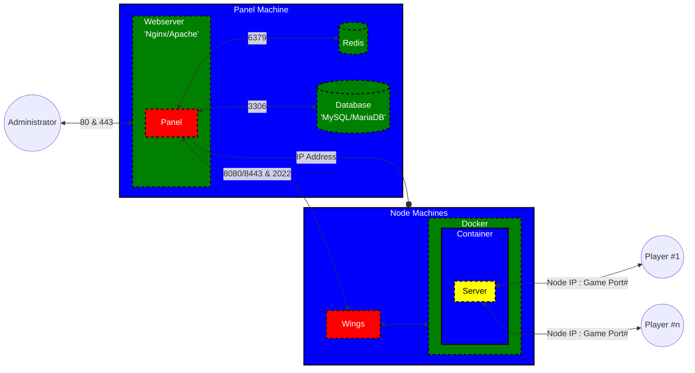
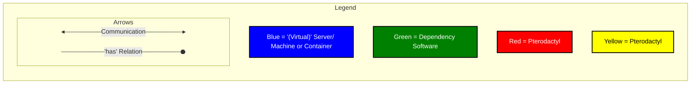

# Terminology
**Panel** — This refers to Pterodactyl Panel itself, and is what allows you to add additional
nodes and servers to the system.

**Node** — A node is a physical machine that runs an instance of Wings.

**Wings** — The newer service written in Go that interfaces with Docker and the Panel to provide secure access for
controlling servers via the Panel.

**Server** — In this case, a server refers to a running instance that is created by the panel. These servers are
created on nodes, and you can have multiple servers per node.

**Docker** — Docker is a platform that lets you separate the application from your infrastructure into isolated, secure containers.

**Docker Image**  — A Docker image contains everything needed to run a containerized application. (e.g. Java for a Minecraft Server).

**Container** — Each server will be running inside an isolated container to enforce hardware limitations
(such as CPU and RAM) and avoid any interference between servers on one node. These are created by Docker.

**Nest** — Each nest is usually used as a specific game or service, for example: Minecraft, Teamspeak or Terraria and can contain many eggs.

**Egg**  — Each egg is usually used to store the configuration of a specific type of game, for example: Vanilla, Spigot or Bungeecord for Minecraft.

**Yolks**  — A curated collection of core docker images that can be used with Pterodactyl's Egg system.

## Simple Setup Diagram

## Advanced Setup Diagram
::: tip Panel and Wings on the same machine
It is also possible to install wings on the panel machine so it acts as panel and node machine at once.
:::

