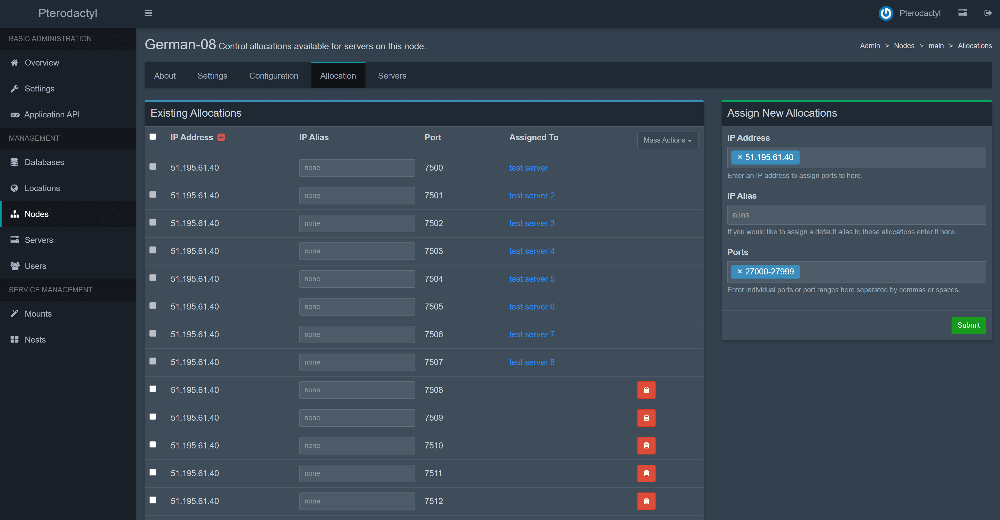

# Installing Wings

Wings is the next generation server control plane from Pterodactyl. It has been rebuilt from the
ground up using Go and lessons learned from our first Nodejs Daemon.

::: warning
You should only install Wings if you are running **Pterodactyl 1.x**. Do not install this software
for previous versions of Pterodactyl.
:::

## Supported Systems

| Operating System | Version |     Supported      | Notes                                                       |
| ---------------- | ------- | :----------------: | ----------------------------------------------------------- |
| **Ubuntu**       | 18.04   | :white_check_mark: | Documentation written assuming Ubuntu 18.04 as the base OS. |
|                  | 20.04   | :white_check_mark: |                                                             |
| **CentOS**       | 7       | :white_check_mark: |                                                             |
|                  | 8       | :white_check_mark: |                                                             |
| **Debian**       | 9       | :white_check_mark: |                                                             |
|                  | 10      | :white_check_mark: |                                                             |

## System Requirements

In order to run Wings you will need a system capable of running Docker containers. Most VPS and almost all
dedicated servers should be capable of running Docker, but there are edge cases.

If your provider makes use of `Virtuozzo`, `OpenVZ` (or `OVZ`), or `LXC` then you will most likely be unable to
run Wings. If you are unsure what your host is using there are a couple of options. The easiest is to check
their website, or reach out to their support team.

If you want to take a different approach, try using `lscpu` and checking what the virtualization type listed is. An
example of this is shown below which shows my hypervisor running with full virtualization — this means it will
support Docker without issues. If you see `KVM` for the vendor, chances are you're fine as well.

```bash
dane@pterodactyl:~$ lscpu | grep 'vendor\|type'
Hypervisor vendor:     VMware
Virtualization type:   full
```

If that doesn't work for some reason, or you're still unsure, you can also run the command below and as long as it
doesn't report `Xen` or `LXC` you're probably okay to continue.

```bash
dane@pterodactyl:~$ sudo dmidecode -s system-manufacturer
VMware, Inc.
```

## Dependencies

- curl
- Docker

### Installing Docker

For a quick install of Docker CE, you can execute the command below:

```bash
curl -sSL https://get.docker.com/ | CHANNEL=stable bash
```

If you would rather do a manual installation, please reference the official Docker documentation for how to install Docker CE on your server. Some quick links
are listed below for commonly supported systems.

- [Ubuntu](https://docs.docker.com/install/linux/docker-ce/ubuntu/#install-docker-ce)
- [CentOS](https://docs.docker.com/install/linux/docker-ce/centos/#install-docker-ce)
- [Debian](https://docs.docker.com/install/linux/docker-ce/debian/#install-docker-ce)

::: warning Check your Kernel
Please be aware that some hosts install a modified kernel that does not support important docker features. Please
check your kernel by running `uname -r`. If your kernel ends in `-xxxx-grs-ipv6-64` or `-xxxx-mod-std-ipv6-64` you're
probably using a non-supported kernel. Check our [Kernel Modifications](kernel_modifications.md) guide for details.
:::

#### Start Docker on Boot

If you are on an operating system with systemd (Ubuntu 16+, Debian 8+, CentOS 7+) run the command below to have Docker start when you boot your machine.

```bash
systemctl enable --now docker
```

#### Enabling Swap

On most systems, docker will be unable to setup swap space, you can check if this is the case by running `docker info`.
If it outputs `WARNING: No swap limit support` near the bottom, this is the case. Enabling swap is completely optional,
but we recommended doing it if you will be hosting for others, and to prevent OOM errors.

To do so, open `/etc/default/grub` as a root user, and find the line starting with `GRUB_CMDLINE_LINUX_DEFAULT`. Make
sure the line includes `swapaccount=1`.

After doing that, simply run `sudo update-grub` followed by `sudo reboot` to restart the server and have swap enabled.
Below is an example of what the line should look like, _do not copy this line verbatium, it often has additional
OS specific parameters._

```text
GRUB_CMDLINE_LINUX_DEFAULT="swapaccount=1"
```

## Installing Wings

The first step for installing Wings is to make sure we have the required directory structure setup. To do so,
run the commands below which will create the base directory and download the wings executable.

:::: tabs
::: tab "Normal Install"

``` bash
mkdir -p /etc/pterodactyl
curl -L -o /usr/local/bin/wings https://github.com/pterodactyl/wings/releases/latest/download/wings_linux_amd64
chmod u+x /usr/local/bin/wings
```

:::
::: tab "ARM64 Install"
If you are using an AArch64/ARM64 CPU, download the ARM64 Wings executable instead by running these commands. Be aware that you will need Docker Images built for ARM64, or your servers will not work.

```bash
mkdir -p /etc/pterodactyl
curl -L -o /usr/local/bin/wings https://github.com/pterodactyl/wings/releases/latest/download/wings_linux_arm64
chmod u+x /usr/local/bin/wings
```

:::
::::

::: warning OVH/SYS Servers
If you are using a server provided by OVH or SoYouStart please be aware that your main drive space is probably allocated to
`/home`, and not `/` by default. Please consider using `/home/daemon-data` for server data. This can be easily
set when creating the node.
:::

## Configure

Once you have installed Wings and the required components, the next step is to create a node on your installed Panel. Go to your Panel administrative view, select Nodes from the sidebar, and on the right side click Create New button.

After you have created a node, click on it and there will be a tab called Configuration. Copy the code block content, paste it into a new file called `config.yml` in `/etc/pterodactyl` and save it.

Alternatively, you can click on the Generate Token button, copy the bash command and paste it into your terminal.


::: warning
When your Panel is using SSL, the Wings must also have one created for its FQDN. See [Creating SSL Certificates](/tutorials/creating_ssl_certificates.html) documentation page for how to create these certificates before continuing.
:::

### Starting Wings

To start Wings, simply run the command below, which will start it in a debug mode. Once you confirmed that it is running without errors, use `CTRL+C` to terminate the process and daemonize it by following the instructions below. Depending on your server's internet connection pulling and starting Wings for the first time may take a few minutes.

```bash
sudo wings --debug
```

You may optionally add the `--debug` flag to run Wings in debug mode.

### Daemonizing (using systemd)

Running Wings in the background is a simple task, just make sure that it runs without errors before doing
this. Place the contents below in a file called `wings.service` in the `/etc/systemd/system` directory.

```text
[Unit]
Description=Pterodactyl Wings Daemon
After=docker.service
Requires=docker.service
PartOf=docker.service

[Service]
User=root
WorkingDirectory=/etc/pterodactyl
LimitNOFILE=4096
PIDFile=/var/run/wings/daemon.pid
ExecStart=/usr/local/bin/wings
Restart=on-failure
StartLimitInterval=180
StartLimitBurst=30
RestartSec=5s

[Install]
WantedBy=multi-user.target
```

Then, run the commands below to reload systemd and start Wings.

```bash
systemctl enable --now wings
```

### Node Allocations

Allocation is a combination of IP and Port that you can assign to a server. Each created server must have at least one allocation. The allocation would be the IP address of your network interface. In some cases, such as when behind NAT, it would be the internal IP. To create new allocations go to Nodes > your node > Allocation.



Type `hostname -I | awk '{print $1}'` to find the IP to be used for the allocation. Alternatively, you can type `ip addr | grep "inet "` to see all your available interfaces and IP addresses. Do not use 127.0.0.1 for allocations.
