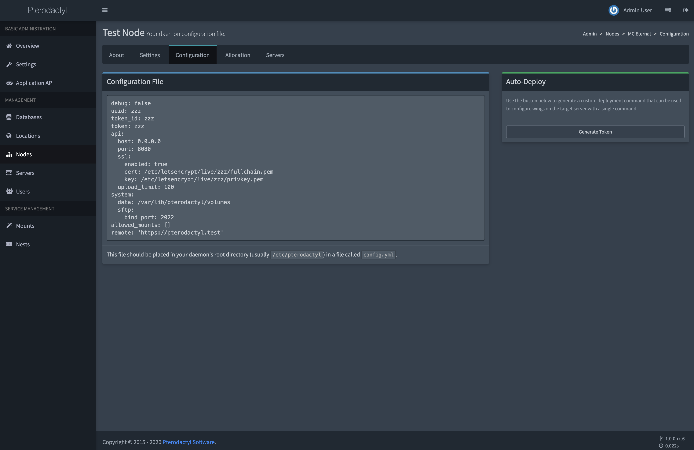

# Migrating to Wings
This guide is for people looking to migrate from the old Node.JS daemon to Wings. Please see the
[install guide](/wings/1.0/installing.md) if you are trying to install Wings for the first time on
a new node.

::: danger Panel Version Requirement
You **must** be running Pterodactyl Panel 1.X in order to use Wings.
:::

You'll have a brief offline period as you perform this process, however no running game processes
will be affected. Plus, chances are your Panel will be offline (or in maintenance mode) during this
so your users should not notice anything out of the ordinary.

## Install Wings
The first step for installing the daemon is to make sure we have the required directory structure setup. To do so,
run the commands below which will create the base directory and download the wings executable.

``` bash
mkdir -p /etc/pterodactyl
curl -L -o /usr/local/bin/wings https://github.com/pterodactyl/wings/releases/latest/download/wings_linux_amd64
chmod u+x /usr/local/bin/wings
```

## Copy New Configuration File
Once you have installed Wings, you'll need to copy over a new configuration file from the Panel. This file
is in a new format, and should be easier for you to manage and edit in the future.

Simply copy and paste the code block and paste it into a file called `config.yml` within the `/etc/pterodactyl`
directory and save it.



::: warning
Please note that any modifications you previously made to the configuration will be lost with this. If you have
modifications to our default settings, the best option is to start Wings once with the copied configuration which
will then populate all of the other configuration settings.

From there you can make any adjustments as necessary.
:::

## Remove Old Daemon
Now that Wings is installed, we need to remove all of the old daemon code from the server since it is not being
used anymore. To do this, simply execute the following commands — assuming your old daemon is in the default
`/srv/daemon` directory.

```bash
# Stop the old daemon.
systemctl stop wings

# Delete the entire directory. There is nothing stored in here that we actually need for the
# purposes of this migration. Remember, server data is stored in /srv/daemon-data.
rm -rf /srv/daemon

# Optionally, remove NodeJS from your system if it was not used for anything else.
apt -y remove nodejs # or: yum remove nodejs
```

### Remove Standalone SFTP
If you've used the [standalone SFTP server](/daemon/0.6/standalone_sftp.html) with the old daemon, we need to remove it's systemd service as well, as it's no longer needed.
You can do so using the following commands.

```bash
# stop and disable the standalone sftp
systemctl disable --now pterosftp

# delete the systemd service
rm /etc/systemd/system/pterosftp.service
```

## Daemonize Wings
You'll then need to edit your existing `systemd` service file for Wings to point to the new control software. To do
this, open `/etc/systemd/system/wings.service` and replace the entire contents of the file with the following:

```
[Unit]
Description=Pterodactyl Wings Daemon
After=docker.service

[Service]
User=root
WorkingDirectory=/etc/pterodactyl
LimitNOFILE=4096
PIDFile=/var/run/wings/daemon.pid
ExecStart=/usr/local/bin/wings
Restart=on-failure
StartLimitInterval=600

[Install]
WantedBy=multi-user.target
```

Then, start wings.

```
systemctl daemon-reload
systemctl enable --now wings
```

::: warning What if Wings doesn't start?
If you encounter issues starting Wings at this point, run the following command to start Wings directly and check
for any specific error output.

```
sudo wings --debug
```
:::
